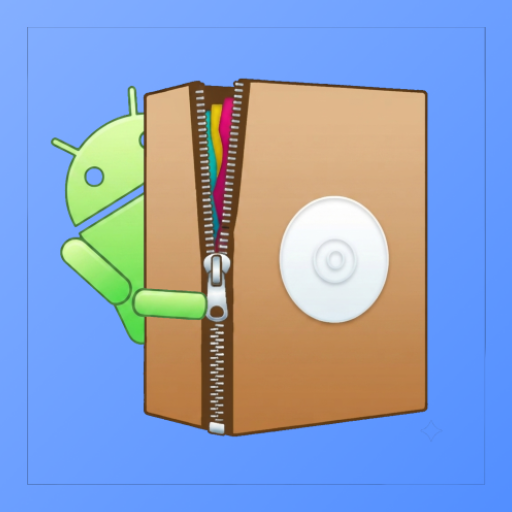
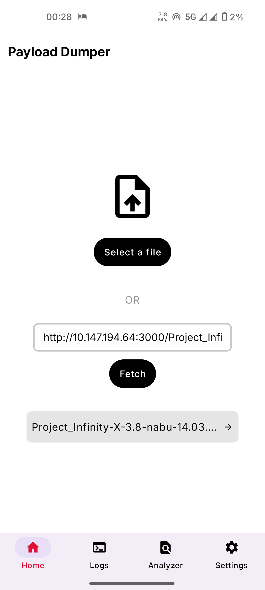
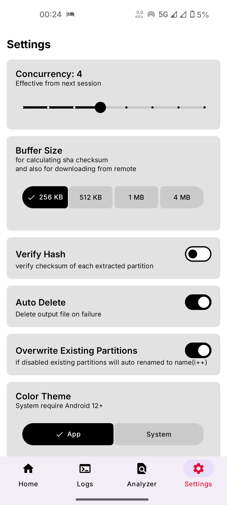
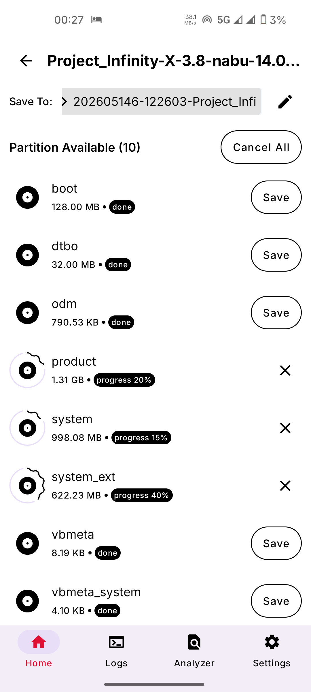
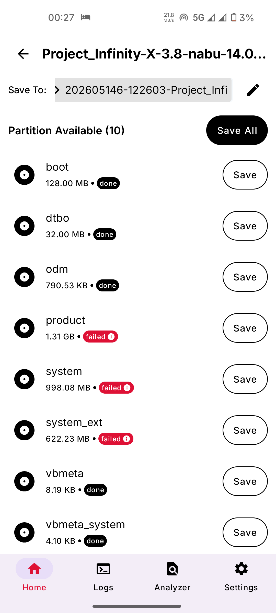
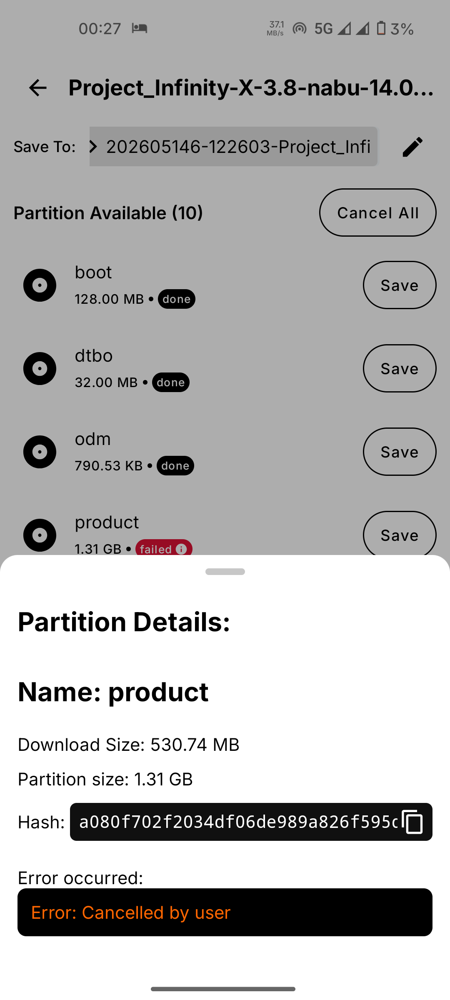

> **Rewrite Completed**

## Please refer to this: [https://keepandroidopen.org/](https://keepandroidopen.org/)

# Payload-Dumper-Android
 

### A powerful OTA extractor app for Android

### You can extract images (boot, vendor_boot...) from a payload.bin or OTA.zip **directly on Android**.

## Installation
- IzzyOnDroid

  

- [GitHub releses](https://github.com/rajmani7584/Payload-Dumper-Android/releases)

## Screenshots

  
  
  
  
  
  

## Features

### Completed features
- ✅ **Progress bar** - displays real-time extraction progress
- ✅ **Integrity check** - hash verification for extracted images
- ✅ **Multi-architecture support** - expanded compatibility
- ✅ **Zip file extraction** - extract directly from OTA zip files
- ~**Raw data view** - option to inspect raw extracted data~
- ✅ **Debug logging** - enhanced troubleshooting and debugging
- ✅ **Incremental detection** - identifies incremental OTAs (extraction not supported yet!)
- ✅ **Parallel extraction** - allow selecting additional images while extraction is in progress
- ✅ **Cancel extraction** - option to abort an ongoing extraction process

### Upcoming features
- ⏳ Analyzer to analyze OTA info on the go
- ⏳ An option to use files directly from otg 
- - not in mind - please open an issue for feature request

### Credits
- Update Engine [metadata_proto](https://github.com/google/ota-analyzer/blob/master/update_metadata.proto)
- [payload-dumper-go](https://github.com/ssut/payload-dumper-go)
- [prost](https://crates.io/crates/prost)

### Contributing
Contributions are welcome!
Feel free to open an issue or submit a pull request to enhance the project.

### License
This project is licensed under the GPL-3.0 license.

> ### _Due to google's announcement of discontinuity of apk install from unregistered developer, and lack of registration (because developers need to pay goole for it) this project might be coming to an end_
**I hope everything would work out in the end**

> Until Google applies this policy, I will be working on this project